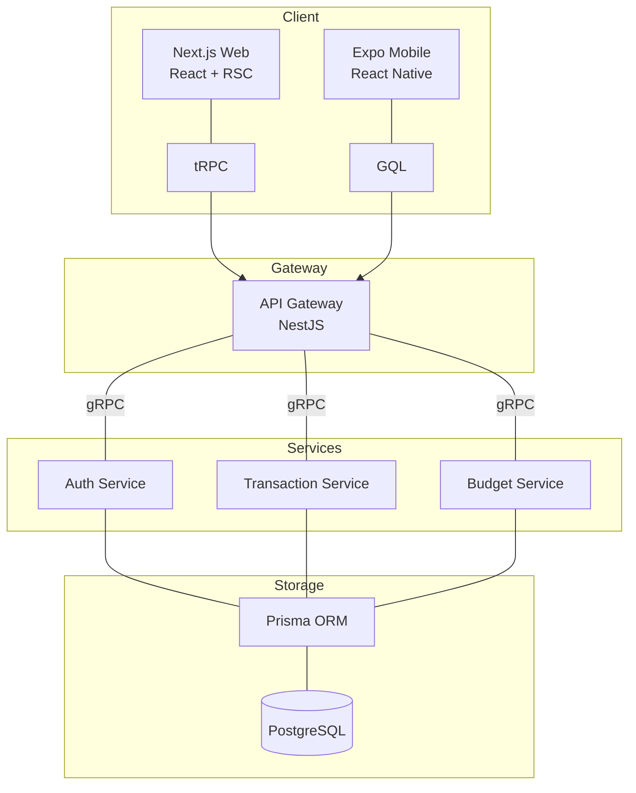

# FinTrack - Smart Personal Finance Management

FinTrack is a comprehensive, learning-focused personal finance management solution designed to provide users with deep insights into their spending habits through modern architecture and advanced algorithms.

---

## 👑 Chief Contributor

|  |
| :-----------------------------------------------------------------: |
|              **[dasiloy](https://github.com/dasiloy)**              |
|                    _Lead Architect / Developer_                     |

---

## 🏗️ Architecture & Tech Stack

FinTrack is built as a highly scalable **Monorepo** using **Turborepo**, ensuring a shared source of truth for types, logic, and UI components across web, mobile, and backend.

### **System Overview**



### **Tech Stack**

- **Monorepo**: Turborepo, PNPM Workspaces
- **Web**: Next.js 14, React Server Components, Tailwind CSS, Jotai
- **Mobile**: Expo (React Native), Apollo Client, GraphQL
- **API Gateway**: NestJS (tRPC, GraphQL, REST)
- **Microservices**: NestJS, gRPC
- **Database**: PostgreSQL (Neon), Prisma ORM
- **AI/ML**: Vercel AI SDK, TensorFlow.js

---

## 🎯 Key Features

- 🔐 **Unified Authentication**: Session-based auth with "Max 2" session limit. Supporting Web (NextAuth) and Mobile (JWT).
- 💸 **Transaction Tracking**: Manual income/expense entry with category auto-suggestion and evidence attachment.
- 📊 **Deep Analytics**: Line, bar, and pie charts for spending distribution and trend analysis.
- 🎯 **Budgeting**: Set limits per category with progress tracking and threshold alerts.
- 🔄 **Recurring Bills**: Managed via Cron jobs with push notification reminders.
- 🤝 **Bill Splitting**: Network-based debt management using the **MinCashFlow (Greedy)** algorithm for simplified settlements.
- 💰 **Savings Goals**: Track milestones with linear regression for completion prediction.
- 📄 **PDF Reports**: Professionally formatted monthly spending and budget vs. actual reports.
- 💳 **Premium Tier**: Stripe-integrated subscription management for advanced features.

---

## 📂 Project Structure

```text
fintrack/
├── apps/
│   ├── api_gateway/    # NestJS Gateway (tRPC/GraphQL proxy)
│   ├── auth_service/   # Core Auth logic (gRPC)
│   ├── payment_service/# Transaction/Split logic (gRPC)
│   └── web/            # Next.js web application
│   ├── mobile/          # Expo mobile application
├── packages/
│   ├── database/       # Prisma schema & Database service
│   ├── common/         # Shared Guards, Decorators & Config
│   ├── types/          # Generated Protobuf & Shared Interface types
│   └── ui/             # Shared Design System components
└── docs/               # Technical guides and journey logs
```

---

## 🎓 Learning Objectives

This project is built to master:

1.  **Microservices Architecture**: Service discovery, gRPC communication, and Gateway patterns.
2.  **DSA in Real World**: Implementing Graph algorithms (MinCashFlow) and Statistical models for financial predictions.
3.  **Modern Web/Mobile**: Reactive state management, Type-safe client-server communication, and Server-side rendering.

---

## 📜 Documentation

For more detailed guides, check the `docs/` folder:

- [System Architecture](docs/architecture.md)
- [Authentication Strategy](docs/authentication-guide.md)
- [Stripe Integration Guide](docs/stripe-integration-guide.md)
- [Features & DSA Mapping](docs/features.md)
- [Design System & UI/UX](docs/design-system.md)
- [Build Journey Log](docs/build-journey.md)
- [Case Study & Business Value](docs/case-study.md)
- [API Contract Template](docs/api-contract-template.json)

---

Copyright © 2026 [dasiloy](https://github.com/dasiloy)
